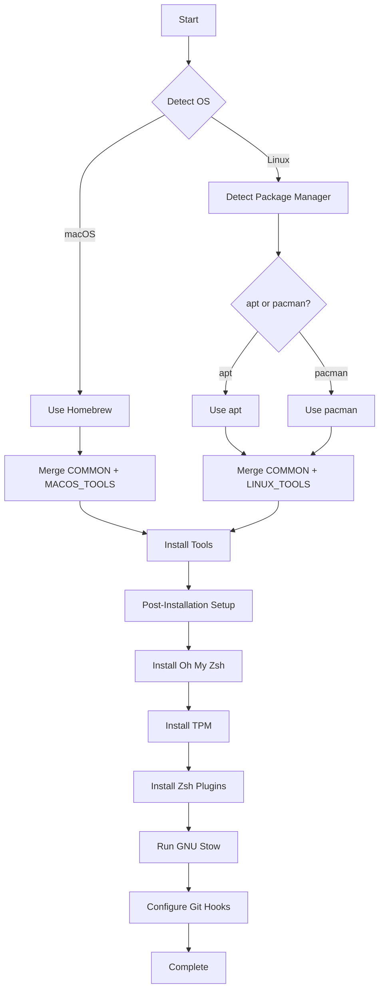
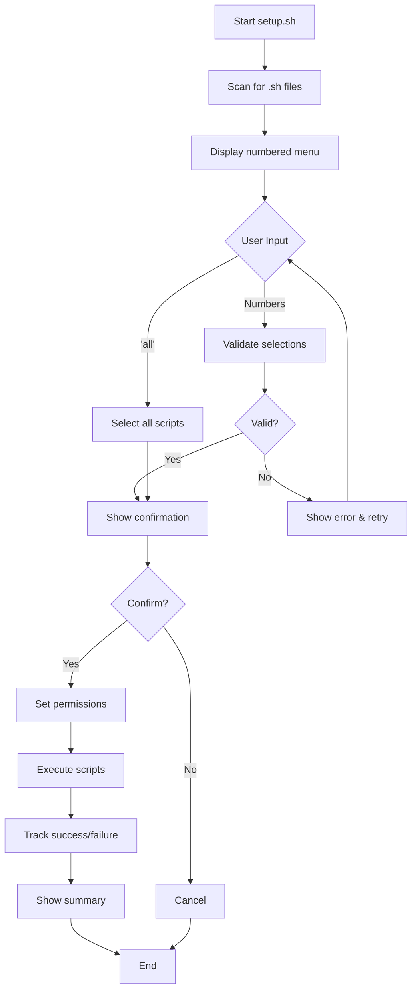
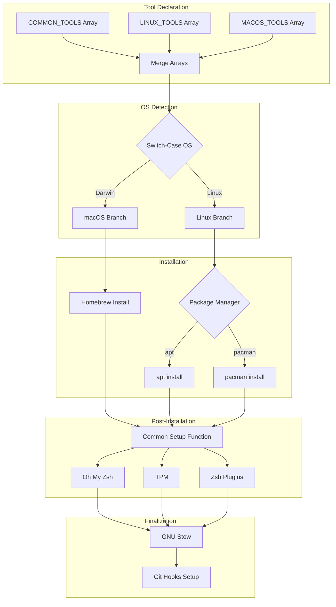
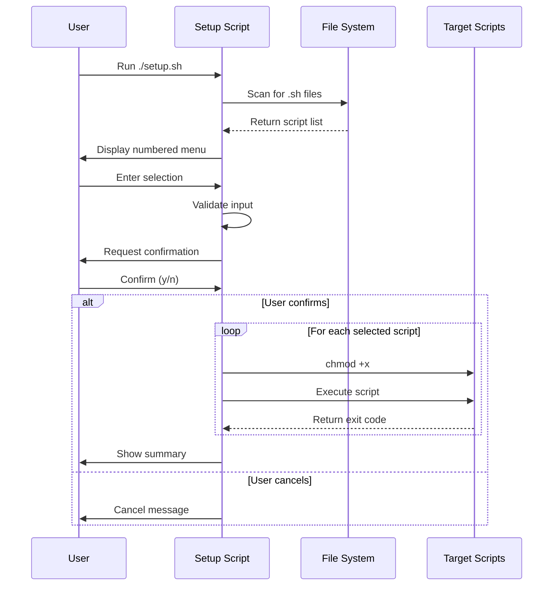
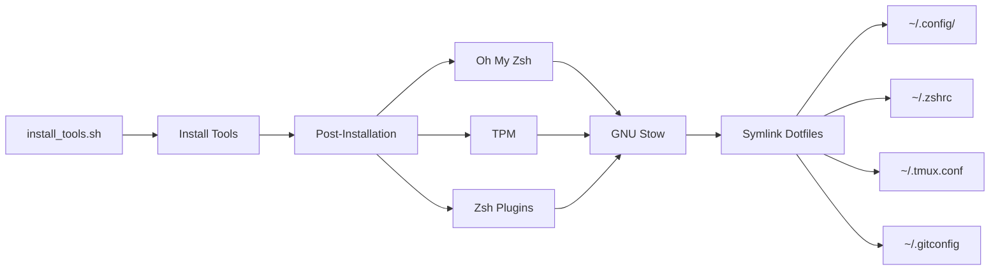
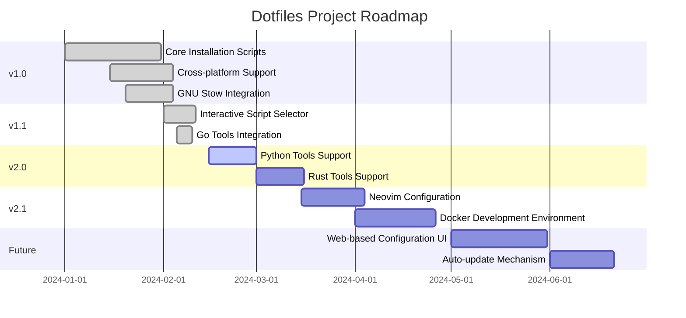

# Dotfiles

Personal configuration files managed with GNU Stow for easy deployment and version control across Linux and macOS systems.

## 📋 Table of Contents

- [Features](#features)
- [Prerequisites](#prerequisites)
- [Quick Start](#quick-start)
- [Installation Methods](#installation-methods)
- [Script Architecture](#script-architecture)
- [What's Included](#whats-included)
- [Directory Structure](#directory-structure)
- [Advanced Usage](#advanced-usage)
- [Customization](#customization)
- [Troubleshooting](#troubleshooting)
- [Contributing](#contributing)
- [License](#license)

## ✨ Features

- 🚀 **Automated Installation** - Single script deployment with automatic OS detection
- 🔧 **Smart Package Management** - Auto-detects `apt`, `pacman`, or `brew` package managers
- 📦 **GNU Stow Integration** - Symlink-based configuration management
- 🔌 **Modular Setup Scripts** - Install only what you need
- 🍎 **Cross-Platform** - Works on Linux (Arch, Ubuntu, Debian) and macOS
- ⚡ **Go Tools Support** - Optional Go development tools installation
- 🎯 **Interactive Script Selector** - Choose which optional tools to install

## 📚 Prerequisites

### Required

- **Git** - Version control system
- **Homebrew** (macOS only) - [Installation Guide](https://brew.sh/)

### Auto-Detected

- **Package Managers**: `apt`, `pacman`, or `brew`
- **Operating Systems**: macOS (Darwin), Linux (Debian/Ubuntu/Arch)

## 🚀 Quick Start

### For Most Users (Complete Setup)

```bash
# Clone the repository
git clone https://github.com/GourangaDasSamrat/dotfiles.git ~/dotfiles
cd ~/dotfiles

# Make executable and run
chmod +x scripts/install_tools.sh
./scripts/install_tools.sh
```

### For Advanced Users (Selective Installation)

```bash
# Clone the repository
git clone https://github.com/GourangaDasSamrat/dotfiles.git ~/dotfiles
cd ~/dotfiles/scripts

# Run interactive setup
chmod +x setup.sh
./setup.sh
```

## 📦 Installation Methods

### Method 1: Main Installer (Recommended)

The `install_tools.sh` script provides a complete, automated setup.

**What it installs:**

- Core development tools
- Shell enhancements (Oh My Zsh, plugins)
- Terminal multiplexer (Tmux + TPM)
- All dotfile configurations via GNU Stow

**Usage:**

```bash
cd ~/dotfiles
./scripts/install_tools.sh
```

**Installation Flow:**



### Method 2: Interactive Selector (Optional Tools)

The `setup.sh` script allows selective installation of optional components.

**Features:**

- Auto-discovery of available scripts
- Interactive numbered menu
- Multiple script selection
- Bulk execution support
- Detailed execution summary

**Usage:**

```bash
cd ~/dotfiles/scripts
./setup.sh

# Example selections:
# - Enter "1" for single script
# - Enter "1 3 5" for multiple scripts
# - Enter "all" for all scripts
```

**Selector Flow:**



## 🏗️ Script Architecture

### Main Installer Architecture



### Tool Management System

```bash
# Centralized tool arrays
COMMON_TOOLS=("alacritty" "bat" "eza" "starship" "stow" "tmux")
LINUX_TOOLS=("zsh")
MACOS_TOOLS=()

# Dynamic merging based on OS
case "$OS" in
    Darwin)
        TOOLS=("${COMMON_TOOLS[@]}" "${MACOS_TOOLS[@]}")
        ;;
    Linux)
        TOOLS=("${COMMON_TOOLS[@]}" "${LINUX_TOOLS[@]}")
        ;;
esac
```

### Script Selector Architecture



## 📂 What's Included

### Core Tools (via `install_tools.sh`)

#### Common Tools (Both Linux & macOS)

| Tool          | Description                  | Use Case                       |
| ------------- | ---------------------------- | ------------------------------ |
| **Alacritty** | GPU-accelerated terminal     | Fast, modern terminal emulator |
| **Bat**       | Cat with syntax highlighting | Better file viewing            |
| **Eza**       | Modern ls replacement        | Enhanced directory listing     |
| **Starship**  | Cross-shell prompt           | Beautiful, fast prompt         |
| **Stow**      | Symlink farm manager         | Dotfile management             |
| **Tmux**      | Terminal multiplexer         | Split terminals, sessions      |

#### Linux-Specific Tools

| Tool    | Description    | Why Linux Only               |
| ------- | -------------- | ---------------------------- |
| **Zsh** | Advanced shell | macOS includes it by default |

#### Optional Tools (via `setup.sh`)

| Tool Category | Script                | Description                     |
| ------------- | --------------------- | ------------------------------- |
| **Go Tools**  | `install_go_tools.sh` | goimports, golangci-lint, gopls |

### Configurations

```
dotfiles/
├── alacritty/      # Terminal emulator config
├── git/            # Git config + custom hooks
├── rofi/           # Application launcher
├── tmux/           # Terminal multiplexer + TPM
├── vscode/         # Editor config + snippets
├── wallpapers/     # Curated wallpapers
└── zsh/            # Shell config + Oh My Zsh
```

### Post-Installation Components

**Installed automatically:**

- **Oh My Zsh** - Zsh framework and plugin manager
- **TPM** - Tmux Plugin Manager
- **zsh-autosuggestions** - Fish-like autosuggestions
- **zsh-syntax-highlighting** - Command syntax validation

**Configuration Flow:**



## 🎯 Advanced Usage

### Manual Stow Operations

```bash
# Install all configurations
cd ~/dotfiles
stow */

# Install specific packages
stow zsh tmux vscode

# Update after changes
stow -R zsh

# Remove configurations
stow -D tmux

# Dry run (see what would happen)
stow -n zsh
```

### Adding Tools to Installation

#### Add Common Tool (Both OS)

```bash
# Edit scripts/install_tools.sh
COMMON_TOOLS=("alacritty" "bat" "eza" "starship" "stow" "tmux" "neovim")
#                                                              ^^^^^^^^ new tool
```

#### Add OS-Specific Tool

```bash
# Linux only
LINUX_TOOLS=("zsh" "build-essential")
#                   ^^^^^^^^^^^^^^^^^ new tool

# macOS only
MACOS_TOOLS=("iterm2")
#            ^^^^^^^^ new tool
```

### Creating Custom Installation Scripts

1. **Create new script:**

```bash
cd ~/dotfiles/scripts
touch install_python_tools.sh
chmod +x install_python_tools.sh
```

2. **Script template:**

```bash
#!/bin/bash

echo "Installing Python tools..."

# Check if Python is installed
if ! command -v python3 &>/dev/null; then
    echo "Error: Python3 is not installed"
    exit 1
fi

# Install tools
pip3 install --user black flake8 mypy

echo "Python tools installed successfully!"
```

3. **Run via selector:**

```bash
./setup.sh
# Your new script will automatically appear in the menu
```

### Stow Advanced Patterns

```bash
# Adopt existing files (move them into dotfiles repo)
stow --adopt zsh

# Simulate without making changes
stow --simulate zsh

# Verbose output
stow --verbose=2 zsh

# Override existing symlinks
stow --override=.* zsh
```

## 🤝 Contributing

### How to Contribute

1. **Fork the repository**

```bash
# On GitHub, click "Fork"
```

2. **Clone your fork**

```bash
git clone https://github.com/YOUR_USERNAME/dotfiles.git
cd dotfiles
```

3. **Create a feature branch**

```bash
git checkout -b feature/my-new-feature
```

4. **Make your changes**

```bash
# Add new configurations, tools, or scripts
# Test thoroughly on your system
```

5. **Commit with clear messages**

```bash
git add .
git commit -m "feat: add neovim configuration"
# Or
git commit -m "fix: resolve stow conflict in zsh config"
# Or
git commit -m "docs: update installation instructions"
```

6. **Push and create Pull Request**

```bash
git push origin feature/my-new-feature
# Then create PR on GitHub
```

### Contribution Guidelines

#### Commit Message Format

Follow [Conventional Commits](https://www.conventionalcommits.org/):

```
<type>(<scope>): <subject>

<body>

<footer>
```

**Types:**

- `feat`: New feature
- `fix`: Bug fix
- `docs`: Documentation changes
- `style`: Code style changes (formatting)
- `refactor`: Code refactoring
- `test`: Adding tests
- `chore`: Maintenance tasks

**Examples:**

```bash
feat(zsh): add custom git aliases
fix(tmux): correct TPM installation path
docs(readme): update installation instructions
refactor(scripts): use switch-case instead of if-else
```

#### Code Style

**Bash Scripts:**

- Use 4 spaces for indentation
- Use descriptive variable names
- Add comments for complex logic
- Include error handling
- Follow [Google Shell Style Guide](https://google.github.io/styleguide/shellguide.html)

**Example:**

```bash
#!/bin/bash

# Function to check if command exists
command_exists() {
    command -v "$1" &>/dev/null
}

# Main installation logic
main() {
    if command_exists "git"; then
        echo "Git is installed"
    else
        echo "Error: Git is not installed"
        exit 1
    fi
}

main "$@"
```

#### Testing

Before submitting:

```bash
# Test on clean system (VM recommended)
# Test on both Linux and macOS (if possible)
# Run shellcheck on scripts
shellcheck scripts/*.sh

# Test stow operations
stow -n */  # Dry run

# Verify no broken symlinks
find ~ -xtype l
```

### Areas for Contribution

- 🐧 Add support for more Linux distributions
- 🛠️ Add installation scripts for other languages (Python, Rust, etc.)
- 📝 Improve documentation
- 🎨 Add more terminal themes
- 🔧 Add more tool configurations
- 🐛 Fix bugs and improve error handling
- ✨ Suggest new features

## 🙏 Acknowledgments

- [GNU Stow](https://www.gnu.org/software/stow/) - Symlink farm manager
- [Oh My Zsh](https://ohmyz.sh/) - Zsh framework
- [Starship](https://starship.rs/) - Cross-shell prompt
- [Tmux Plugin Manager](https://github.com/tmux-plugins/tpm) - TPM
- [Alacritty](https://alacritty.org/) - GPU-accelerated terminal
- The open-source community for inspiration and tools

## 📞 Support

- 📧 **Email**: [gouranga.samrat@gmail.com](mailto:gouranga.samrat@gmail.com)
- 🐛 **Issues**: [GitHub Issues](https://github.com/GourangaDasSamrat/dotfiles/issues)
- 💬 **Discussions**: [GitHub Discussions](https://github.com/GourangaDasSamrat/dotfiles/discussions)

## 🗺️ Roadmap



---

**Made with ❤️ for a better development environment**

<div align="center">

[](https://github.com/GourangaDasSamrat/dotfiles/stargazers)
[](https://github.com/GourangaDasSamrat/dotfiles/network/members)
[](https://github.com/GourangaDasSamrat/dotfiles/issues)
[](https://opensource.org/licenses/MIT)

</div>
